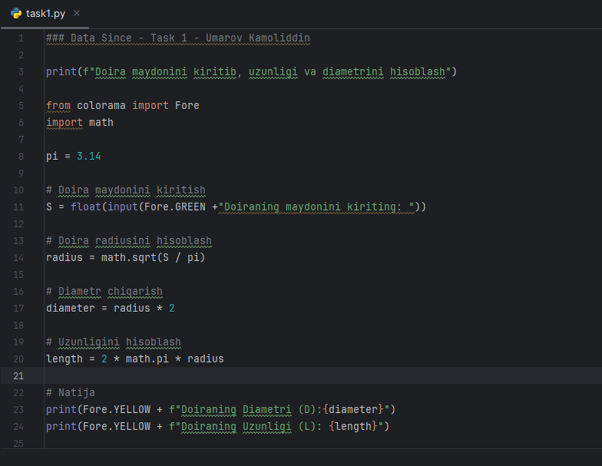
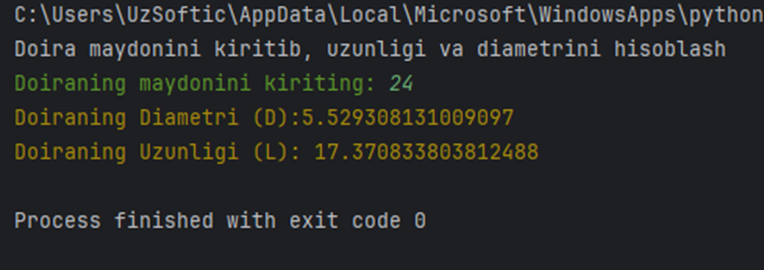
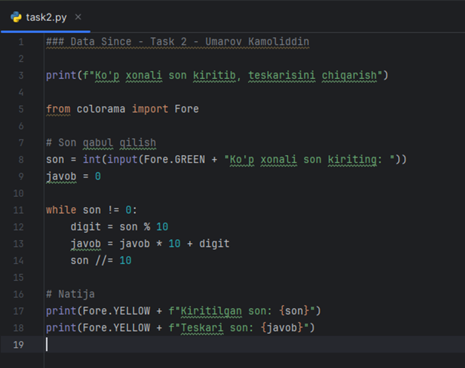
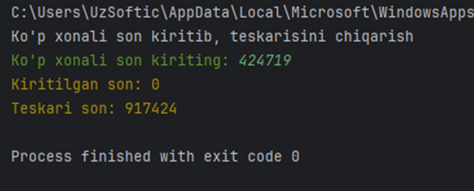
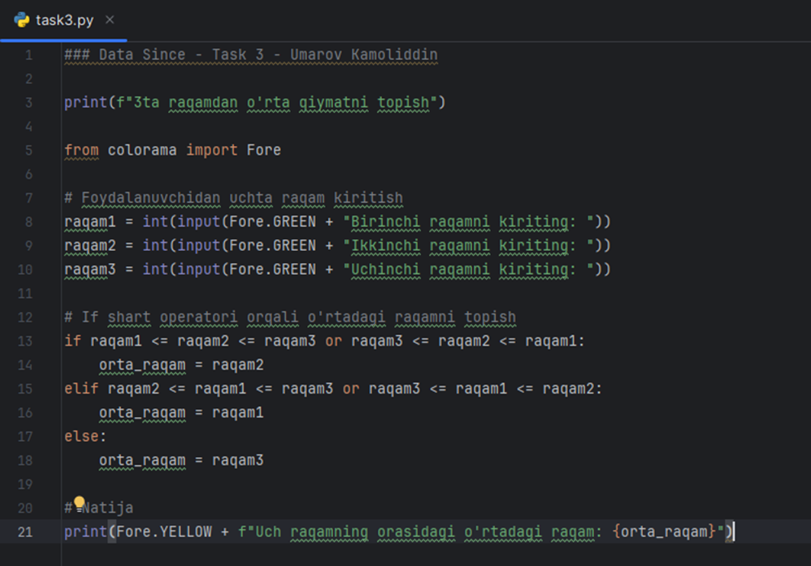
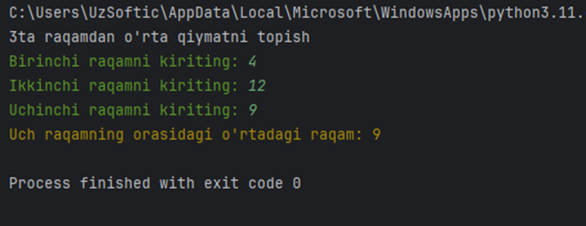
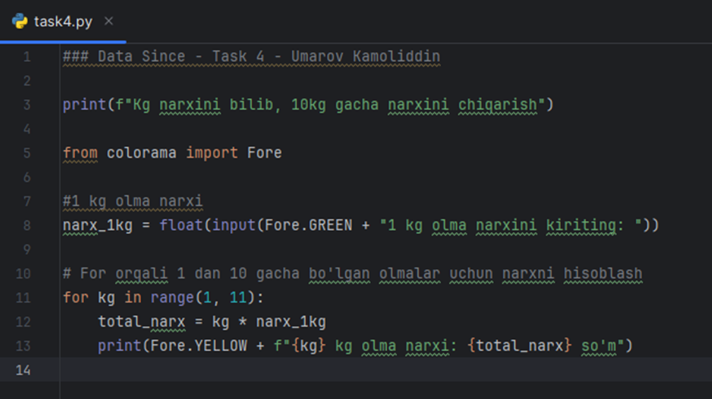
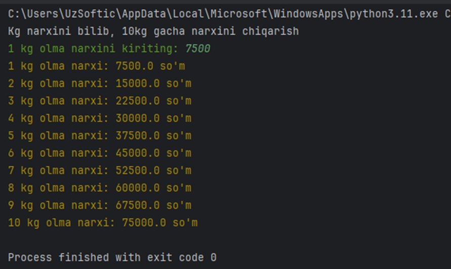
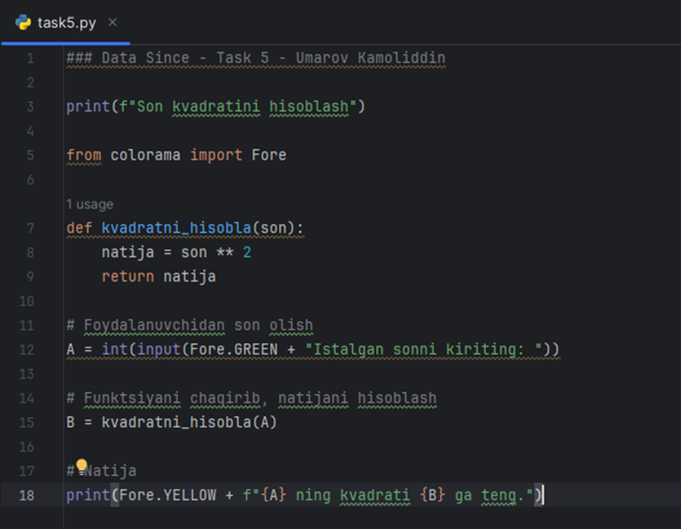
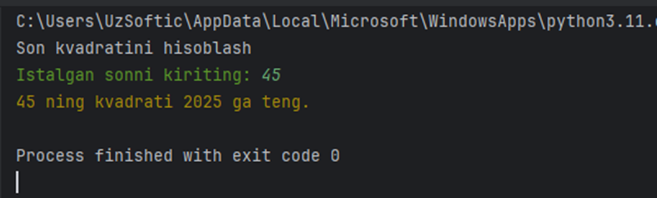

## [Umarov Kamoliddin](https://github.com/uzsoftic) (ISE-51U) 
### Data Since (Assigment-1)

> Github: [https://github.com/KIUT-Projects/data-since-assigment-1](https://github.com/KIUT-Projects/data-since-assigment-1)

# Task-1

# Task-2

# Task-3

# Task-4

# Task-5

